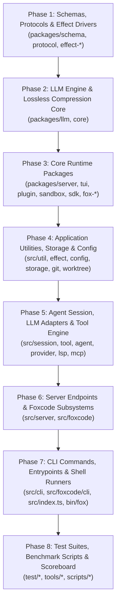

# 🦊 Fox Code CLI — Comprehensive Codebase Review & Quality Plan
> **Target Reviewer / Executor:** Claude Opus (or Senior Staff Software Architect)  
> **Document Purpose:** Complete, structured, phased blueprint for conducting an exhaustive, file-by-file codebase review, quality remediation, comment standardization, and test gap analysis across the `fox-code-cli` monorepo.  
> **Repository Base:** `fox-code-cli` (TypeScript, Bun, Effect-TS, Drizzle SQLite, OpenTUI, AI SDK)  
> **Date:** September 2026

---

## Table of Contents
1. [Executive Overview & Codebase Architecture](#1-executive-overview--codebase-architecture)
2. [Review Scope & Topological Sequencing](#2-review-scope--topological-sequencing)
   - 2.1 Monorepo Inventory & Inclusion Criteria
   - 2.2 Explicit Exclusions & Ignore Rules
   - 2.3 Phased Topological Review Order (Phases 1–8)
3. [Rigorous Review Criteria](#3-rigorous-review-criteria)
   - 3.1 Bug Detection & Concurrency Hazards
   - 3.2 Logic Errors & Edge Cases
   - 3.3 Error Handling & Effect-TS Robustness
   - 3.4 Security Vulnerabilities & Sanitization
   - 3.5 Performance & Compression Invariants
   - 3.6 Code Smells & Maintainability (Legacy Purge)
   - 3.7 API & Schema Consistency
   - 3.8 CLI UX, Terminal Safety & Anti-Hang Guardrails
   - 3.9 Dependency & Runtime Compatibility (Bun vs Node)
4. [Commenting & Documentation Standards](#4-commenting--documentation-standards)
   - 4.1 TSDoc Standard for Functions, Interfaces, and Types
   - 4.2 Effect-TS Specific Documentation (Requirements, Errors, Context)
   - 4.3 Inline Commenting Rules (The "Why", Not the "What")
   - 4.4 Anti-Patterns & Density Ceiling (Zero Trivial Commentary)
5. [Standardized Output Format for Claude Opus](#5-standardized-output-format-for-claude-opus)
   - 5.1 File Review Report Template
   - 5.2 Severity Grading Taxonomy (P0, P1, P2, P3)
   - 5.3 Concrete Remediation Diff Schema
6. [Execution Protocol & Instructions for Claude Opus](#6-execution-instructions-for-claude-opus)
   - 6.1 Step-by-Step Batching Workflow
   - 6.2 Context Window & Token Budget Management
   - 6.3 Handling Ambiguous Logic & Undocumented Invariants
   - 6.4 The "Surgical Improvement" Invariant (Zero Gratuitous Rewrites)
   - 6.5 Master Review Progress Tracker & State Artifacts

---

## 1. Executive Overview & Codebase Architecture

`fox-code-cli` is an enterprise-grade AI coding agent CLI and terminal runtime built on the **Bun** runtime and heavily powered by **Effect-TS** (`@effect/io`, `@effect/schema`, `@effect/platform`). The tool orchestrates agent sessions, large language model streaming, file operations, terminal process execution, lossless token compression, Model Context Protocol (MCP) clients, language server protocol (LSP) integrations, and local SQLite persistence.

### Key Architectural Tenets (Must Be Preserved During Review)
1. **Effect-TS Primitives:** Code utilizing `Effect.gen`, `Effect.tryPromise`, `Layer`, `Context`, `Schedule`, and tagged errors must remain idiomatic Effect-TS. Reviewers must **never** suggest replacing Effect workflows with imperative `async/await` try-catch blocks unless crossing a pure boundary.
2. **Tool System (`packages/core/src/tool/`):** Tools are constructed using the canonical `Tool.make(...)` constructor. `Tools.Service` manages location-scoped tool instances, which intentionally override application-scoped tools. The `ToolRegistry.Service` is location-scoped and must **not** be converted into a process-wide global singleton.
3. **HTTP API Routes (`src/server/routes/`):** Handlers are registered with `HttpApiBuilder.group(...)`. Request handlers must never instantiate or provide layers dynamically via `Effect.provide(Layer)` inside route handlers; services are yielded once at route layer initialization.
4. **Session LLM Runtime (`src/session/llm/`):** Both AI SDK and the native LLM runtime converge on `@opencode-ai/llm` `LLMEvent` streams. `native-request.ts` is the sole adapter permitted to synthesize request parts.
5. **Database Agnosticism (`packages/effect-drizzle-sqlite`):** Database packages must remain generic and depend on `SqlClient`, with no domain tables or Fox-specific schemas leaking into the base driver package.
6. **Config Precedence:** Hierarchical configuration strictly resolves in order: `fox.jsonc` → `fox.json` → `kilo.jsonc` → `kilo.json` → `opencode.jsonc` → `opencode.json`.

---

## 2. Review Scope & Topological Sequencing

The codebase contains approximately 1,750 TypeScript/TSX files across internal monorepo packages (`packages/*`), core application source (`src/*`), test suites (`test/*`), and diagnostic tooling (`tools/*`).

### 2.1 Monorepo Inventory & Inclusion Criteria
Claude Opus must review all source files (`.ts`, `.tsx`, `.d.ts`) and shell scripts in the following functional areas:

| Area | Directory | File Count (approx) | Primary Focus |
|---|---|---|---|
| **Foundation Packages** | `packages/schema/`, `packages/protocol/`, `packages/effect-*` | ~120 | Schemas, tagged errors, database abstraction |
| **LLM & Compression Core**| `packages/llm/`, `packages/core/` | ~360 | Compression algorithms, tool definitions, token counters |
| **Extensions & Runtimes** | `packages/server/`, `packages/tui/`, `packages/plugin*`, `packages/sandbox/`, `packages/sdk/`, `packages/fox-*` | ~510 | OpenTUI components, sandboxing, memory/indexing |
| **Application Utilities** | `src/util/`, `src/effect/`, `src/id/`, `src/env/`, `src/format/` | ~60 | POSIX paths, encoding, BOM, process lifecycle |
| **Agent & Tools Engine** | `src/tool/`, `src/session/`, `src/agent/`, `src/provider/`, `src/lsp/`, `src/mcp/` | ~160 | Prompt hygiene, tool execution, session supersede, AI SDK |
| **Server & Storage** | `src/server/`, `src/storage/`, `src/config/`, `src/git/`, `src/worktree/` | ~120 | Drizzle schemas, Git operations, worktree isolation |
| **Fox Code Integration** | `src/foxcode/` | ~420 | Fox domain adapters, CLI commands, review tools |
| **CLI & Entrypoints** | `src/cli/`, `src/index.ts`, `src/node.ts`, `bin/fox` | ~90 | Command parsing, terminal safety, flags, exit codes |
| **Harnesses & Tests** | `test/`, `packages/*/test/`, `tools/*.sh`, `tools/*.ts` | ~120 | Test fixtures, benchmark scripts, invariants |

### 2.2 Explicit Exclusions & Ignore Rules
The following files and paths are **STRICTLY EXCLUDED** from file-by-file review to prevent token exhaustion and distraction:
- `node_modules/`, `dist/`, `.turbo/`, `.cache/`
- Generated binary files or databases: `*.sqlite`, `*.db`, `*.lancedb`, `*.wasm`
- Massive static text corpora fixtures: `test/corpora/swe-bench-mini/tasks.ts` (evaluated as a whole for data integrity, not line-by-line syntax)
- Pure image or icon assets: `*.png`, `*.jpg`, `*.svg`, `*.ico`
- Lockfiles: `bun.lockb`, `bun.lock`, `package-lock.json`

### 2.3 Phased Topological Review Order (Phases 1–8)
To guarantee that Claude Opus reviews dependencies *before* the code that consumes them, files must be processed in the following 8-phase sequence:



---

## 3. Rigorous Review Criteria

Claude Opus must evaluate every file against the following nine architectural dimensions:

### 3.1 Bug Detection & Concurrency Hazards
- **Race Conditions:** Unsynchronized access to mutable state or in-memory caches across parallel agent turns.
- **Dangling Promises & Effect Leaks:** Promises created without `Effect.tryPromise` or unawaited async operations that could fail silently or leak execution context.
- **Resource Desynchronization:** Subprocess handles, file descriptors, or database connections not properly scoped with `Effect.acquireRelease` or `using`.

### 3.2 Logic Errors & Edge Cases
- **BOM & UTF-8 Encodings:** Verify that file reading routines correctly strip or preserve Byte Order Marks (BOM) using `src/util/bom.ts`.
- **Cross-Platform Path Normalization:** Check for hardcoded `/` or `\` separators; verify POSIX normalization when interacting with git or remote workspaces.
- **Boundary Conditions & Off-by-One:** Truncation routines, sliding window token buffers, line number calculations (1-based vs 0-based), and regex match indices.
- **Null / Undefined Coalescing:** Vulnerability to `Cannot read properties of undefined` in deeply nested API responses.

### 3.3 Error Handling & Effect-TS Robustness
- **Tagged Errors:** Ensure errors inherit from `Data.TaggedError` or implement discriminated unions (`_tag: string`).
- **Unchecked Defect Elimination:** Prohibit untyped `throw new Error()` inside Effect generators; all failures must be captured via `Effect.fail` or typed `catchTag`.
- **Process Exit Cleanliness:** Ensure unexpected errors do not terminate the daemon without flushing pending logs, metrics, or telemetry.

### 3.4 Security Vulnerabilities & Sanitization
- **Shell & Command Injection:** Verify that shell execution in `src/tool/shell.ts`, `packages/core/src/tool/bash.ts`, and git utilities safely quote arguments or use argument arrays rather than string concatenation.
- **Path Traversal:** Ensure file tools (`src/tool/read.ts`, `src/tool/write.ts`, `src/tool/edit.ts`) enforce sandbox boundaries and prevent `../../etc/passwd` escapes.
- **Secret & Token Leakage:** Check that sensitive environment variables (`ANTHROPIC_API_KEY`, `OPENAI_API_KEY`, `GITLAB_TOKEN`) are redacted from log outputs, debug traces, and session JSON dumps.

### 3.5 Performance & Compression Invariants
- **Lossless Token Compression:** Verify that compression rules in `packages/core/src/tool/compress.ts` maintain structural fidelity (e.g. valid patch syntax, table alignment, JSON schema validity).
- **Regex ReDoS:** Audit all regular expressions for catastrophic backtracking, especially those parsing git diffs, markdown tables, or ANSI escape codes.
- **Memory Allocation & Buffering:** Flag unbounded array accumulation or reading multi-gigabyte files into memory without streaming.

### 3.6 Code Smells & Maintainability (Legacy Purge)
- **Dead Kilocode / OpenCode Remnants:** Detect unreferenced cloud telemetry, legacy account endpoints, or obsolete comment stubs.
- **Duplication (DRY):** Identify duplicate helper functions shared between `src/util` and `src/foxcode/util`.
- **Cyclomatic Complexity:** Identify functions exceeding 50 lines or with deeply nested branching (>4 levels) that warrant decomposing into pure sub-effects.

### 3.7 API & Schema Consistency
- **Schema Validation:** Ensure schemas use `@effect/schema` or Zod uniformly according to package boundary rules.
- **Tool Parameter Contracts:** Verify that every tool defines explicit input schemas with descriptions for LLM tool calling.
- **HTTP Endpoint Typing:** Enforce that routes in `src/server/` have strict typed request/response contracts using `HttpApiSchema`.

### 3.8 CLI UX, Terminal Safety & Anti-Hang Guardrails (CRITICAL)
- **Anti-Hang Invariants:** Any command executed by CLI tools or test runners **must** specify an explicit timeout ceiling (e.g. `timeout: 30000`).
- **Non-Interactive Execution:** No interactive prompts (e.g. `inquirer`, raw readline loops) without a headless fallback flag or non-TTY check.
- **ANSI & TUI Rendering:** Ensure raw ANSI escape codes are stripped when stdout is piped (`!process.stdout.isTTY`).

### 3.9 Dependency & Runtime Compatibility (Bun vs Node)
- **Runtime Native APIs:** Verify that Bun-specific globals (`Bun.file`, `Bun.spawn`) have appropriate fallbacks or are restricted to Bun-targeted execution modules.
- **External Package Imports:** Ensure external dependencies are listed in the appropriate `package.json` and not imported across decoupled package boundaries.

---

## 4. Commenting & Documentation Standards

Claude Opus must assess and propose docstrings and inline commentary according to the following strict rules:

### 4.1 TSDoc Standard for Functions, Interfaces, and Types
All exported types, interfaces, services, and top-level functions must have TSDoc-compliant documentation:

```typescript
/**
 * Compresses raw git diff output using lossless token reduction algorithms.
 *
 * Preserves hunk line headers, modified markers (+/-), and file paths while
 * trimming redundant unchanged context beyond the required threshold.
 *
 * @param diff - The raw unified diff string to compress.
 * @param options - Configuration options for compression limits and anchors.
 * @returns An Effect resolving to the compressed string and compression statistics.
 *
 * @example
 * ```typescript
 * const result = await Effect.runPromise(compressUnifiedDiff(rawDiff, { maxContext: 3 }));
 * ```
 */
```

### 4.2 Effect-TS Specific Documentation (Requirements, Errors, Context)
Every Effect-yielding function must explicitly document its **R** (Context/Requirements), **E** (Expected Errors), and **A** (Success Type):
- Document each typed error that can be yielded (`@throws` or `@yields TaggedError`).
- Document required services (`@requires Tools.Service`, `@requires Config.Service`).

### 4.3 Inline Commenting Rules (The "Why", Not the "What")
- **Permitted Comments:**
  - Explaining non-obvious algorithmic invariants or mathematical proofs (e.g. token counting ratio calculations).
  - Clarifying external workarounds for third-party bugs or platform limitations (e.g. Bun vs Node child_process differences).
  - Highlighting security constraints or defensive assumptions.
- **Forbidden Comments (Zero Tolerance):**
  - Paraphrasing the code (`// increment i by 1`).
  - Commented-out dead code (must be deleted).
  - Redundant type annotations in comments (`// returns string`).

### 4.4 Anti-Patterns & Density Ceiling
Comment density should be approximately 5–15% of lines of code. Code must be self-documenting through precise domain naming (`compressUnifiedDiff` rather than `procDiff`).

---

## 5. Standardized Output Format for Claude Opus

To ensure complete consistency across hundreds of files, Claude Opus must deliver its review for each file using the exact Markdown template below.

### 5.1 File Review Report Template

```markdown
### 📄 File Review: [`path/to/file.ts`](file:///home/k82l0804/workarea/fox/fox-code-cli/path/to/file.ts)

#### 1. Executive Summary & Responsibility
- **Role:** High-level description of what the module accomplishes.
- **Layer / Scope:** (e.g. `packages/core` Tool Producer, `src/server` Route Handler, etc.)
- **Key Dependencies:** External packages or internal services relied upon.

#### 2. Architectural & Invariant Compliance
- [x] Effect-TS Idiomatic Patterns (or N/A)
- [x] Anti-Hang & Timeout Safety
- [x] Security & Argument Sanitization
- [x] Error Tagging & Failure Channel Strictness

#### 3. Issues & Defects
| ID | Severity | Line Range | Category | Description |
|---|---|---|---|---|
| ERR-01 | **P1** | L45-L52 | Concurrency | Unprotected shared cache mutation during concurrent requests |
| ERR-02 | **P2** | L112 | Robustness | Missing BOM check before parsing UTF-8 file content |

#### 4. Concrete Remediation & Refactoring Proposal
**Issue ERR-01 Remediation:**
```typescript
// BEFORE:
cache[key] = value;

// AFTER:
yield* Ref.update(cacheRef, (map) => HashMap.set(map, key, value));
```

#### 5. Proposed Documentation & TSDoc (Exact Drop-in Text)
```typescript
/**
 * Exact drop-in replacement docstring for exported symbols.
 */
```

#### 6. Test Gap Analysis
- **Missing Invariants:** Specific edge cases not covered by existing tests.
- **Recommended Test Case:** Concrete test assertion for `bun test`.
```

### 5.2 Severity Grading Taxonomy
- **P0 (Blocker):** Security vulnerabilities (command injection, path traversal), terminal hangs/deadlocks, data loss, or crashes breaking the primary agent loop.
- **P1 (Major):** Unhandled Effect defects, memory leaks, concurrency races, silent failure of tools, or token compression corruption.
- **P2 (Minor):** Suboptimal performance, edge-case logic flaws, inconsistent error tags, or lack of parameter validation.
- **P3 (Nit):** Missing docstrings, dead code, stylistic inconsistencies, or non-critical refactoring opportunities.

---

## 6. Execution Instructions for Claude Opus

When assigned to execute the review, Claude Opus must strictly follow this autonomous execution protocol:

### 6.1 Step-by-Step Batching Workflow
1. **Initialize Batch:** Claude Opus reviews one logical package or directory group at a time (e.g., `packages/core/src/tool/`).
2. **Read File via Built-in Tooling:** Inspect the entire target file using `view_file` (with line ranges). Never guess file contents from memory.
3. **Verify Context:** Check related imports and consumer interfaces before making claims about unused code or signature mismatches.
4. **Emit Structured Review:** Output the review using the standardized Section 5.1 template.
5. **Update Master Tracker:** Mark the reviewed file as completed in the session's progress record.

### 6.2 Context Window & Token Budget Management
- Claude Opus must process files in batches of **3 to 5 medium files** (or **1 to 2 large files >500 lines**) per turn.
- If a file exceeds 800 lines, Claude Opus must inspect it in logical sections (Types/Interfaces → Core Logic → Exported Services) to ensure no subtle bugs are missed due to attention dilution.

### 6.3 Handling Ambiguous Logic & Undocumented Invariants
- If Claude Opus encounters ambiguous logic:
  1. It must search for existing test fixtures in `test/` or `packages/*/test/` that exercise the code.
  2. If the logic appears deliberate (e.g., a specific regex pattern for git diff parsing), Claude Opus must **not** claim it is a bug unless it can construct a concrete failing input.
  3. It must document the ambiguity under "Architectural Invariant" and propose a test case to pin down expected behavior.

### 6.4 The "Surgical Improvement" Invariant
- **No Gratuitous Rewriting:** Claude Opus must never suggest rewriting functioning, idiomatic code merely to suit personal preference.
- **Respect Established Conventions:** Keep Effect-TS code in Effect; keep vanilla utilities vanilla. Maintain backward compatibility for all CLI flags, configuration fields, and tool outputs.

### 6.5 Master Review Progress Tracker
Claude Opus must maintain a review tracker artifact (`docs/reviews/full-codebase-review-tracker.md`) with the following structure:

```markdown
# 📊 Codebase Review Master Progress Tracker

| Phase | Subsystem / Package | Total Files | Reviewed | Status | P0/P1 Issues Found |
|---|---|---|---|---|---|
| 1 | `packages/schema`, `protocol`, `effect-*` | 123 | 0 | ⏳ Pending | 0 |
| 2 | `packages/llm`, `core` | 363 | 0 | ⏳ Pending | 0 |
| 3 | `packages/server`, `tui`, `plugin`, etc. | 512 | 0 | ⏳ Pending | 0 |
| 4 | `src/util`, `effect`, `config`, `storage` | 82 | 0 | ⏳ Pending | 0 |
| 5 | `src/session`, `tool`, `agent`, `provider` | 158 | 0 | ⏳ Pending | 0 |
| 6 | `src/server`, `src/foxcode` | 496 | 0 | ⏳ Pending | 0 |
| 7 | `src/cli`, `src/foxcode/cli`, entrypoints | 95 | 0 | ⏳ Pending | 0 |
| 8 | `test/*`, `tools/*` | 124 | 0 | ⏳ Pending | 0 |
```

---
*Blueprint verified for architectural compliance with Fox Code CLI engine guidelines.*
