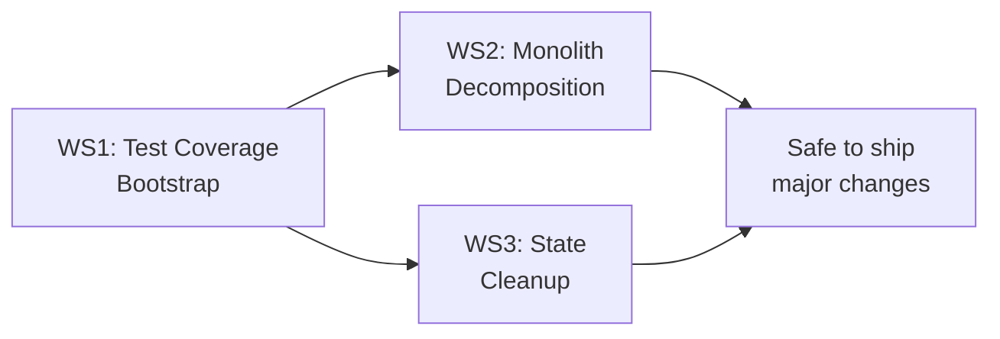

# Fox Code CLI — Post-Review Action Plan

> **Source:** Full codebase review (Phases 1–8) — 1,846 files, ~237K lines
> **Findings:** 0 P0, 22 P1, 37 P2, 64 P3 issues
> **Created:** 2026-09-21
> **Philosophy:** Fix the *pressure points* that create 80% of the risk. Don't touch 237K lines — touch the 10 files that matter.

---

## Strategy

Three workstreams, executed in dependency order:



**WS1 (Tests)** unblocks everything else. You cannot safely refactor monoliths or migrate state without tests catching regressions. WS2 and WS3 can run in parallel once WS1 establishes baseline coverage.

---

## WS1 — Test Coverage Bootstrap

### Priority: 🔴 CRITICAL | Timeline: Week 1–2

The orchestration layer (~1,400 files) has **zero automated tests**. This is the single highest-leverage fix.

### 1.1 — Pure Function Tests (Week 1)

These functions have clear inputs, clear outputs, and no side effects. Test them first.

| Function | File | Lines | Why It's First |
|---|---|:---:|---|
| `toLLMEvents` | [`ai-sdk.ts`](file:///home/k82l0804/workarea/fox/fox-code-cli/src/session/llm/ai-sdk.ts#L65) | ~400 | Pure stream adapter — converts AI SDK events to `LLMEvent`. **Most critical untested code path.** |
| Doom-loop detection | [`processor.ts`](file:///home/k82l0804/workarea/fox/fox-code-cli/src/session/processor.ts#L460) | ~20 | Compares recent tool calls via `JSON.stringify`. Easy to test, easy to break. |
| `isOrphanedInterruptedTool` | [`prompt.ts`](file:///home/k82l0804/workarea/fox/fox-code-cli/src/session/prompt.ts#L137) | 4 | Guards orphaned tool cleanup — pure predicate |
| `mcpResourceBase64Size` | [`prompt.ts`](file:///home/k82l0804/workarea/fox/fox-code-cli/src/session/prompt.ts#L126) | 5 | Base64 size calculation — pure math |
| `FoxSessionOverflow.count` | [`overflow.ts`](file:///home/k82l0804/workarea/fox/fox-code-cli/src/foxcode/session/overflow.ts#L32) | 4 | Token counting — pure |
| `FoxSessionOverflow.limit` | [`overflow.ts`](file:///home/k82l0804/workarea/fox/fox-code-cli/src/foxcode/session/overflow.ts#L37) | 8 | Overflow threshold — pure |
| `FoxSessionOverflow.measure` | [`overflow.ts`](file:///home/k82l0804/workarea/fox/fox-code-cli/src/foxcode/session/overflow.ts#L48) | ~35 | Payload measurement with opaque state handling — pure |
| `summaryText` | [`compaction.ts`](file:///home/k82l0804/workarea/fox/fox-code-cli/src/session/compaction.ts#L62) | 8 | Extracts summary from message parts — pure |
| `completedCompactions` | [`compaction.ts`](file:///home/k82l0804/workarea/fox/fox-code-cli/src/session/compaction.ts#L72) | 16 | Finds completed compaction pairs — pure |
| `turns` | [`compaction.ts`](file:///home/k82l0804/workarea/fox/fox-code-cli/src/session/compaction.ts#L95) | 18 | Extracts conversation turns — pure |
| `preserveRecentBudget` | [`compaction.ts`](file:///home/k82l0804/workarea/fox/fox-code-cli/src/session/compaction.ts#L89) | 5 | Budget calculation — pure |
| `ensureDockerRm` | [`mcp/index.ts`](file:///home/k82l0804/workarea/fox/fox-code-cli/src/mcp/index.ts#L60) | 10 | Docker args injection — pure |
| `Goal.action` | [`goal/runner.ts`](file:///home/k82l0804/workarea/fox/fox-code-cli/src/foxcode/session/goal/runner.ts#L33) | 12 | Tool part outcome classification — pure |

**Target test files:**
```
test/
├── session/
│   ├── llm-adapter.test.ts         # toLLMEvents conversion
│   ├── processor-doom-loop.test.ts # Doom-loop detection
│   ├── compaction-pure.test.ts     # summaryText, turns, completedCompactions
│   └── overflow.test.ts            # count, limit, measure
├── tool/
│   └── mcp-docker.test.ts          # ensureDockerRm
└── foxcode/
    └── goal-action.test.ts         # Goal.action classification
```

### 1.2 — State Machine / Integration Tests (Week 2)

Once pure functions are covered, test the state transitions:

| Test Target | What to Verify |
|---|---|
| Processor event loop | LLM event → session state transition (text, tool-use, tool-result, finish) |
| Tool execution lifecycle | pending → running → completed/error |
| Session status transitions | idle → busy → idle, with cancellation |
| Compaction trigger | Token count exceeds threshold → compaction fires |
| Permission flow | Tool requires permission → blocked → user approves → resumes |

**Approach:** Mock the LLM stream (create synthetic `LLMEvent` sequences) and feed them through the processor. Assert the resulting `SessionV1` state.

### 1.3 — Quick Wins (Day 1)

These are one-line fixes from the review that require zero tests:

| Fix | File | Effort |
|---|---|---|
| Replace hardcoded path with `import.meta.dir` | `test/standard-suite.test.ts:44` | 1 min |
| Replace `JSON.stringify` equality with `fast-deep-equal` | `processor.ts:469` | 5 min |
| Move `globalThis.AI_SDK_LOG_WARNINGS = false` to `src/index.ts` | `prompt.ts:100` | 5 min |
| Add JSDoc to compaction constants | `compaction.ts:38-44` | 10 min |
| Add JSDoc to board store constants | `board/store.ts` | 10 min |

---

## WS2 — Monolith Decomposition

### Priority: 🟡 HIGH | Timeline: Week 3–6 | Prerequisite: WS1.1 complete

**Rule: Do NOT refactor monoliths directly.** Extract, test, repeat.

### 2.1 — `prompt.ts` (2,504 lines) → `src/session/prompt/`

This is the largest file. Natural extraction seams:

| Module | Lines to Extract | Functions / Logic |
|---|:---:|---|
| `prompt/attachment.ts` | ~80 | `mcpResourceBase64Size`, `formatMcpResourceBytes`, MCP resource handling |
| `prompt/structured.ts` | ~30 | `STRUCTURED_OUTPUT_DESCRIPTION`, `STRUCTURED_OUTPUT_SYSTEM_PROMPT`, `createStructuredOutputTool` |
| `prompt/orphan.ts` | ~10 | `isOrphanedInterruptedTool` + related cleanup |
| `prompt/command.ts` | ~200 | Command parsing and `/slash` command execution |
| `prompt/shell.ts` | ~150 | Shell session creation and management |
| `prompt/resume.ts` | ~150 | Session resume/continuation logic |
| `prompt/context.ts` | ~300 | Message assembly, system prompt building |
| `prompt/index.ts` | remainder | Orchestration: `prompt()`, `loop()`, `shell()`, `command()` |

**Process for each extraction:**
1. Identify the seam (set of functions with limited cross-dependencies)
2. Move to new file with `export`
3. Import from new file in `prompt.ts`
4. Run `bun run typecheck` to verify
5. Run existing tests to verify no regression
6. Write a test for the extracted module
7. Commit

### 2.2 — `src/cli/cmd/run/` (14,500 lines across 20 files)

This is already split into files, but the subsystem itself is too tightly coupled. The key refactor is creating a clean boundary:

```
packages/mini-tui/          # NEW package
├── src/
│   ├── state/              # session-data.ts, subagent-data.ts
│   ├── transport/           # stream.transport.ts
│   ├── ui/                  # footer.*.tsx
│   ├── theme.ts
│   └── index.ts            # Public API
└── test/                    # Snapshot tests for UI rendering
```

**Prerequisite:** This is a larger refactor. Don't start until WS1.2 is complete and you have integration tests for the run command.

### 2.3 — `background-process/index.ts` (1,251 lines)

Split into:
- `background-process/schema.ts` — `ID`, `Status`, `Lifetime`, `Ready`, `Info` schemas
- `background-process/lifecycle.ts` — Start, stop, ready detection
- `background-process/output.ts` — Output capture and truncation
- `background-process/index.ts` — Service registration and orchestration

---

## WS3 — Module-Level State Cleanup

### Priority: 🟡 HIGH | Timeline: Week 3–5 | Prerequisite: WS1.1 complete

### 3.1 — Audit: Files with module-level mutable state

The following 24 files have module-level `Map`, `Set`, or `let` that should be migrated:

**Critical (5+ state variables):**
| File | State Variables | Risk |
|---|:---:|---|
| [`sandbox/policy.ts`](file:///home/k82l0804/workarea/fox/fox-code-cli/src/foxcode/sandbox/policy.ts) | 5 Maps + 1 let | Memory leak, no cleanup on teardown |
| [`session/prompt.ts`](file:///home/k82l0804/workarea/fox/fox-code-cli/src/foxcode/session/prompt.ts) | `intakes` Map | Race condition (P1-3) |

**Moderate (1–2 state variables):**
| File | State |
|---|---|
| [`indexing.ts`](file:///home/k82l0804/workarea/fox/fox-code-cli/src/foxcode/indexing.ts) | `consent` Map — never pruned |
| [`indexing-worker.ts`](file:///home/k82l0804/workarea/fox/fox-code-cli/src/foxcode/indexing-worker.ts) | Worker state Map |
| [`plan-followup.ts`](file:///home/k82l0804/workarea/fox/fox-code-cli/src/foxcode/plan-followup.ts) | Plan tracking Map |
| [`pr-link.ts`](file:///home/k82l0804/workarea/fox/fox-code-cli/src/foxcode/pr-link.ts) | PR state Map |
| [`provider/codex-refresh.ts`](file:///home/k82l0804/workarea/fox/fox-code-cli/src/foxcode/provider/codex-refresh.ts) | Refresh state Map |
| [`provider/metadata.ts`](file:///home/k82l0804/workarea/fox/fox-code-cli/src/foxcode/provider/metadata.ts) | Metadata cache Map |
| [`sandbox/inheritance.ts`](file:///home/k82l0804/workarea/fox/fox-code-cli/src/foxcode/sandbox/inheritance.ts) | Inheritance Map |
| [`session/title.ts`](file:///home/k82l0804/workarea/fox/fox-code-cli/src/foxcode/session/title.ts) | Title tracking Map |
| [`mcp/index.ts`](file:///home/k82l0804/workarea/fox/fox-code-cli/src/mcp/index.ts) | `pendingOAuthTransports` Map |
| [`effect/instance-registry.ts`](file:///home/k82l0804/workarea/fox/fox-code-cli/src/foxcode/effect/instance-registry.ts) | Registry Map |

### 3.2 — Migration Pattern

The codebase already has the right pattern: `InstanceState.make()`. This is the existing Effect-native solution for per-instance state.

**Before (dangerous):**
```typescript
// Module-level — lives forever, no cleanup, no isolation
const snapshots = new Map<string, Snapshot>()
const locks = new Map<SessionID, { semaphore: Semaphore; refs: number }>()
let revision = 0
```

**After (safe):**
```typescript
// Per-instance — cleaned up on teardown, isolated for testing
const state = yield* InstanceState.make(() =>
  Effect.succeed({
    snapshots: new Map<string, Snapshot>(),
    locks: new Map<SessionID, { semaphore: Semaphore; refs: number }>(),
    revision: 0,
  })
)
```

**Migration process per file:**
1. Identify all module-level `Map`/`Set`/`let` variables
2. Group them into a single state type
3. Replace with `InstanceState.make()`
4. Update all access sites to use `InstanceState.get()`
5. Run `bun run typecheck`
6. Verify no regression

### 3.3 — Priority order

1. **`sandbox/policy.ts`** — 5 Maps, highest leak risk, directly affects security
2. **`foxcode/session/prompt.ts`** — `intakes` Map, has a documented race condition (P1-3)
3. **`indexing.ts`** — `consent` Map never pruned, grows unbounded
4. **`mcp/index.ts`** — `pendingOAuthTransports`, auth state leaked
5. Everything else — lower urgency, batch together

---

## WS4 — Security & Correctness Quick Fixes

### Priority: 🟠 MEDIUM | Timeline: Anytime (independent)

These are standalone fixes that don't require WS1–3 as prerequisites:

| # | Issue | File | Fix | Effort |
|---|---|---|---|:---:|
| 1 | Auth token in query string | `middleware/authorization.ts` | Restrict `auth_token` to WebSocket upgrade paths | 30 min |
| 2 | Unconditional `process.exit()` | `src/index.ts:168` | Add 500ms I/O flush timeout before exit | 15 min |
| 3 | Windows `process.type` monkey-patch | `mcp/index.ts:5-7` | Scope to MCP client creation, restore after | 30 min |
| 4 | LSP binary download without checksum | `lsp/server.ts` | Add SHA-256 verification (follow sandbox pattern) | 2 hr |
| 5 | SSE timeout leak | `provider.ts:55-94` | Clear timeout ID in `cancel()` handler | 15 min |
| 6 | Legacy plugin tools bypass validation | `registry.ts:166-178` | Add `ajv` validation for JSON Schema path | 1 hr |

---

## WS5 — Housekeeping & Tech Debt

### Priority: 🟢 LOW | Timeline: Ongoing

| # | Issue | Effort | Notes |
|---|---|:---:|---|
| 1 | Fix outdated `kilo` branding in comments | 1 hr | `git grep "kilo run\|kilo --mini\|kilocode"` — batch sed |
| 2 | Move `docs/migration.md` out of `src/foxcode/` | 5 min | Checked into source tree |
| 3 | Add removal plan for `claude-migration.ts` (962 lines) | 15 min | One-time migration, needs expiry version |
| 4 | Exclude `session-v2-debug.tsx` from production | 15 min | 1,227-line debug plugin ships in release |
| 5 | Consolidate `scripts/test-*.sh` with `package.json` | 30 min | Duplicate test orchestration |
| 6 | Daemon Zod → Effect Schema migration | 2 hr | `daemon.ts` uses Zod while everything else uses Effect Schema |
| 7 | Integrate benchmarks into CI | 2 hr | Run `bun run test:standard-suite` on PRs |

---

## Execution Timeline

```
Week 1  ┃ WS1.1: Pure function tests (12 functions → 6 test files)
        ┃ WS1.3: Quick wins (5 one-line fixes)
        ┃ WS4: Security fixes (auth token, process.exit, SSE leak)
────────╋──────────────────────────────────────────────────
Week 2  ┃ WS1.2: State machine / integration tests
        ┃ WS3.2: Migrate sandbox/policy.ts (highest leak risk)
────────╋──────────────────────────────────────────────────
Week 3  ┃ WS2.1: Begin prompt.ts extraction (attachment, structured, orphan)
        ┃ WS3.2: Migrate foxcode/session/prompt.ts, indexing.ts
────────╋──────────────────────────────────────────────────
Week 4  ┃ WS2.1: Continue prompt.ts extraction (command, shell, resume)
        ┃ WS3.2: Migrate remaining 9 files
────────╋──────────────────────────────────────────────────
Week 5  ┃ WS2.3: Split background-process/index.ts
        ┃ WS5: Housekeeping batch
────────╋──────────────────────────────────────────────────
Week 6+ ┃ WS2.2: Mini-TUI package extraction (if needed)
        ┃ Ongoing: P3 nits, documentation, CI integration
```

---

## Success Metrics

| Metric | Current | Week 2 Target | Week 6 Target |
|---|:---:|:---:|:---:|
| Test files for orchestration layer | 0 | 6 | 15+ |
| Pure functions with tests | 0 | 12 | 30+ |
| Files with module-level mutable state | 24 | 22 | 5 |
| Largest single file (lines) | 2,504 | 2,504 | <800 |
| P1 issues open | 22 | 18 | 8 |
| P2 issues open | 37 | 34 | 20 |

---

## Reference: Review Artifacts

| Phase | Report |
|---|---|
| Phase 1 — Foundation Packages | [`phase1_review.md`](../../.gemini/antigravity-ide/brain/7016f0cd-3355-4501-a8fe-2ae21a5f1b6a/phase1_review.md) |
| Phase 2 — LLM Engine & Compression | [`phase2_review.md`](../../.gemini/antigravity-ide/brain/7016f0cd-3355-4501-a8fe-2ae21a5f1b6a/phase2_review.md) |
| Phase 3 — Core Runtime Packages | [`phase3_review.md`](../../.gemini/antigravity-ide/brain/7016f0cd-3355-4501-a8fe-2ae21a5f1b6a/phase3_review.md) |
| Phase 4 — Application Utilities | [`phase4_review.md`](../../.gemini/antigravity-ide/brain/7016f0cd-3355-4501-a8fe-2ae21a5f1b6a/phase4_review.md) |
| Phase 5 — Agent Session & Tools | [`phase5_review.md`](../../.gemini/antigravity-ide/brain/7016f0cd-3355-4501-a8fe-2ae21a5f1b6a/phase5_review.md) |
| Phase 6 — Server & Foxcode | [`phase6_review.md`](../../.gemini/antigravity-ide/brain/7016f0cd-3355-4501-a8fe-2ae21a5f1b6a/phase6_review.md) |
| Phase 7 — CLI & Entrypoints | [`phase7_review.md`](../../.gemini/antigravity-ide/brain/7016f0cd-3355-4501-a8fe-2ae21a5f1b6a/phase7_review.md) |
| Phase 8 — Tests & Benchmarks | [`phase8_review.md`](../../.gemini/antigravity-ide/brain/7016f0cd-3355-4501-a8fe-2ae21a5f1b6a/phase8_review.md) |
| Tracker | [`full-codebase-review-tracker.md`](../reviews/full-codebase-review-tracker.md) |
